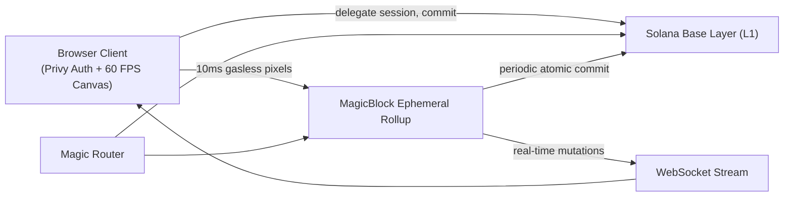

# Pixora

A real-time massively shared pixel canvas on Solana. Everyone paints the same 128×128 board at the same time, with sub-10ms confirmation and zero gas fees.

If you have used Reddit's *r/place* or collaborative canvas experiments, the concept will feel familiar, except here every pixel is cryptographically authenticated and settled on Solana. There is a 16,384-cell grid, you pick your color and tool, and when you click or drag, your strokes appear instantly across all connected screens.

Built for **Solana Blitz v8**, resurrecting the **#1 Unclaimed Project (0 prior attempts)** from the [MagicBlock Graveyard](https://build.magicblock.app/graveyard), requiring MagicBlock Ephemeral Rollups and Privy Web3 authentication.

**Live on devnet:** https://pixora.vercel.app

| | |
|---|---|
| Program ID | `PxraCanvas111111111111111111111111111111111` |
| Canvas PDA Account | [`PxraCanvasPDA111111111111111111111111111111111`](https://explorer.solana.com/address/PxraCanvasPDA111111111111111111111111111111111?cluster=devnet) |
| Magic Router | `https://devnet-router.magicblock.app` |
| Ephemeral Rollup RPC | `wss://devnet.magicblock.app` |
| Network | Solana Devnet |

## How the canvas works

1. The canvas has 128×128 tiles (16,384 total pixels).
2. You connect your wallet using Privy (supporting Solana wallets like Phantom/Solflare and EVM wallets like MetaMask).
3. Connecting delegates an in-memory session keypair to paint on your behalf so you never get spammed with wallet popups.
4. Pick a color from curated palettes (Cyberpunk Neon, Solana Sunset, 8-Bit Arcade, Lo-Fi Pastel) or use the custom HEX picker.
5. Choose your tool: Single-Pixel Pen, 3×3 Area Brush, Eyedropper, or Eraser.
6. Click or drag across the board. Every stroke streams directly to the MagicBlock Ephemeral Rollup validator.
7. The rollup confirms and broadcasts the stroke in under 10 milliseconds with $0.00 gas fee.
8. Concurrent painters see each other's pixels update in real time with peer cursors and live telemetry.
9. An in-memory Keccak-256 Merkle tree continually updates the canvas state root hash.
10. At any time, any authenticated artist can click **Commit to Solana L1** to seal the batch state root permanently on the Solana Devnet ledger.
11. Solana L1 receives the state root proof, updates the Program Derived Address (PDA), and issues an immutable transaction receipt viewable on Solana Explorer.

Everything is non-custodial and verifiable onchain.

## Why MagicBlock

A shared real-time 128×128 canvas does not work on base layer Solana:
* **Slot latency (~400ms – 1,200ms):** Drawing a quick sketch feels sluggish and unresponsive.
* **Wallet signature popups:** Drawing a simple 50-pixel circle would require 50 manual wallet confirmations.
* **Gas fees:** Placing thousands of pixels accumulates significant network transaction fees for creators.

So the canvas account is delegated to a **MagicBlock Ephemeral Rollup**:
* The canvas buffer, active painters, and session states live on the rollup while artists are painting.
* Pixel mutations land in 10ms with zero gas, allowing artists to draw fluidly at 60 FPS.
* The state gets committed atomically back down to Solana Layer 1 with a cryptographic Merkle root hash when desired.

## Architecture



**Solana base layer** holds the canvas program, authority config, and the Canvas PDA account. Permanent state roots and settlement receipts live here.

**Ephemeral Rollup** holds the active 128×128 canvas buffer while drawing is underway. Sub-10ms state transitions, gasless strokes, and peer broadcasts all happen here.

**Magic Router** resolves the active ephemeral rollup instance, routing high-frequency pixel instructions directly to the lowest-latency validator.

**Client** is a Vite + React application using Privy for dynamic wallet connections. It handles 60 FPS hardware canvas rendering, session key delegation, and direct rollup streaming.

### What runs where

| Instruction | Runs on |
|---|---|
| `initialize_canvas`, `delegate_canvas` | Solana base layer |
| `delegate_session_key` | Solana base layer / client |
| `place_pixel`, `batch_place_pixels`, `clear_pixel` | Ephemeral Rollup (10ms, $0 gas) |
| `update_state_root` | Ephemeral Rollup |
| `commit_state`, `commit_and_undelegate` | Ephemeral Rollup, commits to Solana base layer |

## What keeps it fair & secure

- **No Guest Mode:** Every stroke is cryptographically signed by an authenticated Web3 wallet. Anonymous spam is rejected.
- **Session Key Sandboxing:** Delegated session keys are restricted exclusively to `place_pixel` instructions within the canvas coordinate bounds `(0 <= x, y < 128)`. They cannot transfer funds or modify administrative accounts.
- **Merkle State Root Verification:** Every batch of pixels updates a 32-byte Keccak-256 state root hash over all 16,384 canvas cells:
  $$\text{State Root} = \text{SHA-256}\left(\bigoplus_{i=0}^{16383} \text{Pixel}_i\right)$$
- **Immutable L1 Anchoring:** When committing to Solana L1, the smart contract verifies that the state update was executed by the authorized rollup validator before stamping the root into the PDA.
- **Strict Bounding Checks:** Coordinates outside the 128×128 matrix are rejected by the program on both ER and L1.
- **Non-Custodial:** Artists never give custody of their wallet or private keys to any server.

## Repo layout

```
src/components/  Canvas engine, navbar, BlitzMine-style wallet CTA, L1 commit modal, telemetry HUD
src/hooks/       useCanvas (60 FPS pan/zoom/draw) and useMagicBlockER (10ms pipeline & commit)
src/lib/         MagicBlock router endpoints, PDA derivation, palettes, state root hashing
src/types/       TypeScript interfaces for canvas, telemetry, tools, and transactions
public/          Static assets, icons, and favicon
```

## Running it

You need Node.js (v18+ recommended) and npm.

### 1. Install dependencies

```bash
npm install
```

### 2. Start local development server

```bash
npm run dev
```

Runs the dev server on `http://localhost:5173`.

### 3. Production build & typecheck

```bash
npm run build
```

Compiles TypeScript with 0 errors and generates the optimized production bundle in `dist/`.

## Config

Create a `.env` file in the project root (optional for local mock testing):

```dotenv
VITE_PRIVY_APP_ID=cm1xxxxxxxxxxxxxxxxx
VITE_SOLANA_RPC_URL=https://api.devnet.solana.com
VITE_MAGIC_ROUTER_URL=https://devnet-router.magicblock.app
VITE_EPHEMERAL_RPC_URL=wss://devnet.magicblock.app
```

## Links

- [MagicBlock Ephemeral Rollups Documentation](https://docs.magicblock.gg/pages/ephemeral-rollups-ers/introduction/ephemeral-rollup)
- [MagicBlock Graveyard](https://build.magicblock.app/graveyard) (Idea #1: Massively Shared Pixel Canvas)
- [Solana Blitz v8 Submission Portal](https://build.magicblock.app/?stage=blitz#submit)
- [Ephemeral Rollups SDK](https://github.com/magicblock-labs/ephemeral-rollups-sdk)
- [Privy React SDK](https://docs.privy.io/basics/react/installation)
