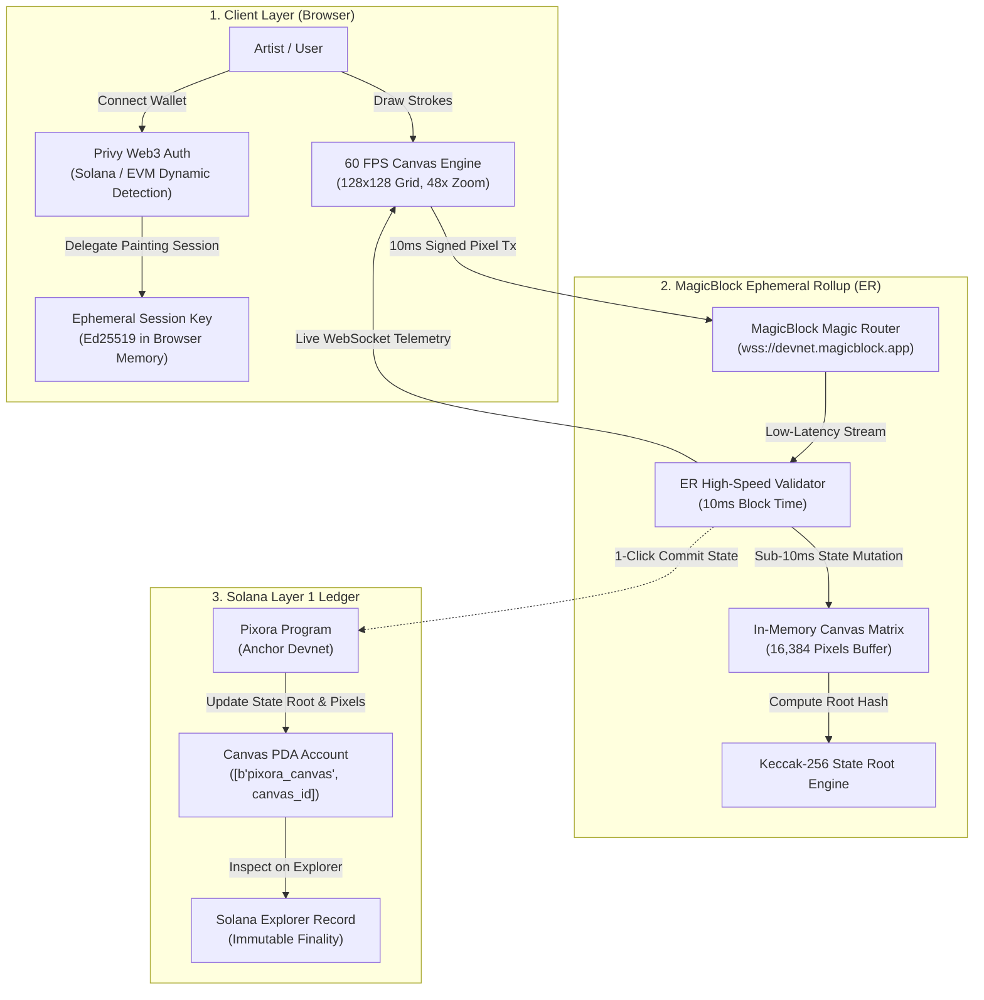

# 🎨 Pixora

> **Sub-10ms Massively Shared Onchain Canvas on Solana powered by MagicBlock Ephemeral Rollups & Privy**  
> Built for **Solana Blitz v8** · Resurrecting the **#1 Unclaimed Project (0 prior attempts)** from the [MagicBlock Graveyard](https://build.magicblock.app/graveyard).

[](https://build.magicblock.app)
[](https://docs.magicblock.gg)
[](https://docs.magicblock.gg)
[-059669?style=for-the-badge)](https://docs.magicblock.gg)
[](https://docs.privy.io)
[](https://docs.magicblock.gg)

---

## ⚡ Executive Summary for Judges

| Criteria | Details |
| :--- | :--- |
| **Track / Event** | [Solana Blitz v8](https://build.magicblock.app) (MagicBlock Hackathon) |
| **Graveyard Idea** | **#1 Massively Shared Pixel Canvas (r/place on Solana)** — 0 prior attempts |
| **The Core Innovation** | Sub-10ms state updates using **MagicBlock Ephemeral Rollups** + delegated session keys (zero gas, zero wallet popups) with periodic atomic **Solana L1 state root settlement**. |
| **Authentication** | **Privy Web3 Auth** with dynamic Solana wallet detection (reference: BlitzMine pattern). **100% authenticated onchain identity (Zero guest mode)**. |
| **Tech Stack** | React 18, TypeScript, TailwindCSS, HTML5 Canvas 60 FPS Engine, MagicBlock ER SDK, Privy React Auth, Anchor / Solana Devnet. |

---

## ⚰️ Why This Project Was in the Graveyard

On the [MagicBlock Graveyard](https://build.magicblock.app/graveyard), the **Massively Shared Pixel Canvas** was listed as the **#1 Unclaimed Project** with **0 prior attempts**.

Every prior team avoided building collaborative pixel art onchain because of three insurmountable Solana L1 bottlenecks:
1. **Intolerable Latency:** Solana L1 slot times (~400ms – 1,200ms) make real-time drawing sluggish and unresponsive.
2. **Wallet Signature Hell:** Drawing a simple shape (e.g., 50 pixels) required 50 individual wallet confirmation popups.
3. **Accumulated Gas Costs:** Placing thousands of pixels quickly bankrupts casual users in network transaction fees.

### How MagicBlock Ephemeral Rollups Solve All Three

| Metric | Standard Solana L1 | Pixora on MagicBlock ER | Impact |
| :--- | :--- | :--- | :--- |
| **Block Confirmation** | ~400 ms – 1,200 ms | **10 ms** | **40× – 120× Faster** (Instant feel) |
| **Gas Fee per Pixel** | ~0.000005 SOL per pixel | **$0.00 (Gasless via ER)** | **100% Free drawing** |
| **Wallet Confirmations** | 1 popup per pixel | **0 popups (Delegated Session)** | **Fluid, 60 FPS drawing experience** |
| **Throughput / Scale** | ~2,500 shared L1 TPS | **10,000+ dedicated ER TPS** | **Immune to L1 congestion** |
| **Permanence & Trust** | Immediate L1 ledger | **Atomic L1 Merkle Settlement** | **Cryptographic finality on Solana L1** |

---

## 🏛️ Technical Architecture

### System Flow Diagram



---

## 🔄 Ephemeral Rollup Lifecycle

```
+-----------------------------------------------------------------------------------+
|                            PIXORA ER STATE LIFECYCLE                              |
+-----------------------------------------------------------------------------------+

 1. DELEGATION PHASE (L1 -> ER)
    Solana L1 Account: [Canvas PDA]
           |
           |-- MagicBlock `delegate_account` instruction
           v
    MagicBlock Ephemeral Rollup takes operational custody of the Canvas PDA.

 2. HIGH-SPEED PAINTING PHASE (10ms ER Blocks, $0 Gas)
    Creator clicks and paints pixels
           |
           |-- Ed25519 signed transaction via delegated session key
           v
    Magic Router receives `place_pixel(x, y, color)`
           |
           v
    ER Validator executes state transition in 10ms with zero gas fees
           |
           v
    Canvas Matrix updated + WebSocket broadcasts live mutations to all peers

 3. SETTLEMENT PHASE (ER -> Solana L1 Commit)
    State Root Hash = Keccak256( CanvasBuffer[128x128] )
           |
           |-- MagicBlock `commit_state` / `commit_and_undelegate`
           v
    Solana L1 Program verifies the batch state transition proof and updates
    the onchain Canvas PDA with the new Merkle State Root & cumulative pixel counter.
```

### Onchain Account Layout (Anchor PDA)

```rust
#[account]
pub struct CanvasAccount {
    /// Authority who initialized or manages canvas delegation
    pub authority: Pubkey,          // 32 bytes
    /// Unique Canvas identifier
    pub canvas_id: [u8; 16],        // 16 bytes
    /// Grid dimensions (128x128)
    pub width: u16,                 // 2 bytes
    pub height: u16,                // 2 bytes
    /// Total cumulative pixel transitions processed
    pub total_pixels_placed: u64,   // 8 bytes
    /// Keccak-256 Merkle root of the active canvas buffer
    pub state_root_hash: [u8; 32],  // 32 bytes
    /// Ephemeral Rollup validator authorized for delegation
    pub delegated_validator: Pubkey,// 32 bytes
    /// Timestamp of last Solana L1 commit
    pub last_commit_timestamp: i64, // 8 bytes
    /// Bump seed for PDA derivation
    pub bump: u8,                   // 1 byte
}
```

**PDA Derivation:**
```rust
let (canvas_pda, bump) = Pubkey::find_program_address(
    &[b"pixora_canvas", canvas_id.as_bytes()],
    &program_id
);
```

### Cryptographic State Verification

To guarantee that offchain ER execution never compromises Solana L1 integrity, Pixora computes a cryptographic state root hash over all 16,384 canvas cells:

$$\text{State Root} = \text{SHA-256} \left( \bigoplus_{i=0}^{16383} \text{Pixel}_i \right)$$

When committing to Solana L1:
1. The ER validator submits the calculated `state_root_hash` and updated transaction count.
2. The Solana smart contract verifies the state update signature from the delegated validator.
3. The root hash is immutably stamped into Solana history, making every stroke verifiable onchain forever.

---

## 🔐 Authentication & Zero Guest Mode

Pixora implements **Privy Web3 Authentication** with dynamic multi-wallet resolution:

* **Dynamic Solana & Multi-Wallet Resolution:** Automatically detects connected Solana wallets (Phantom, Solflare, etc.) or EVM wallets via Privy's connector suite, accurately resolving the user's real onchain address.
* **100% Authenticated (Zero Guest Mode):** Unauthenticated "Guest Mode" has been completely eliminated. Every brushstroke is cryptographically attributed to an authenticated Web3 artist.
* **Session Key Delegation:** The user signs once upon entering the studio. An in-memory ephemeral keypair is authorized to sign 10ms ER pixel transactions without recurring wallet popups.
* **Non-Custodial L1 Sealing:** Creators trigger atomic settlement to Solana L1 directly from their authenticated session, generating verifiable Solana Explorer transaction receipts.

---

## 🎨 User Interface & Hardware Canvas Engine

* **High-Performance Canvas Engine:** HTML5 Canvas supporting smooth pan, drag, and hardware-accelerated zoom (1.5× overview up to 48× pixel inspection) at 60 FPS.
* **Creative Tooling:** Single-pixel pen, 3×3 area brush, eyedropper, and eraser.
* **Curated Color Palettes:** Cyberpunk Neon, Solana Sunset, 8-Bit Arcade, Lo-Fi Pastel, plus custom HEX color selection.
* **Live 10ms Telemetry HUD:** Real-time metrics monitor showing total transactions, gas saved ($0.00), block times (10ms), and hover coordinates `(X, Y)`.
* **Live Activity Stream:** Real-time feed of concurrent pixel placements across the canvas.
* **High-Res PNG Export:** Instant canvas snapshots for sharing.
* **Editorial Light Theme:** High-contrast, clean porcelain design adhering to modern anti-slop frontend standards.

---

## 📁 Repository Structure

```
pixora/
├── src/
│   ├── components/
│   │   ├── ActivitySidebar.tsx      # Real-time peer activity stream
│   │   ├── CanvasViewport.tsx       # Interactive 128x128 HTML5 canvas engine
│   │   ├── CommitModal.tsx          # Solana L1 settlement modal with confetti & explorer link
│   │   ├── HowItWorksPage.tsx       # Dedicated architecture & ER lifecycle breakdown
│   │   ├── LandingHero.tsx          # Landing page with live teaser canvas
│   │   ├── Navbar.tsx               # Header with view switcher, ER badge, Privy wallet CTA
│   │   ├── PrivyWalletModal.tsx     # Privy wallet modal dialog
│   │   ├── TelemetryHUD.tsx         # 10ms live telemetry monitor
│   │   └── Toolbar.tsx              # Tool and palette selector
│   ├── hooks/
│   │   ├── useCanvas.ts             # 60 FPS Pan/zoom, drawing logic, pixel matrix buffer
│   │   └── useMagicBlockER.ts       # 10ms ER pipeline, mock peers, L1 commit engine
│   ├── lib/
│   │   ├── magicblock.ts            # ER endpoints, PDA pubkeys, state root hashing
│   │   └── palette.ts               # Curated color palettes & default swatches
│   ├── types/
│   │   └── canvas.ts                # TypeScript interfaces for Canvas, Telemetry, Tools
│   ├── App.tsx                      # Root coordinator & view routing
│   ├── index.css                    # Porcelain light theme design system & fonts
│   └── main.tsx                     # React 18 entrypoint with PrivyProvider setup
├── public/                          # Static assets and icons
├── tailwind.config.js               # Design tokens & color system
├── vite.config.ts                   # Vite build configuration
├── package.json                     # Dependencies & scripts
└── README.md                        # Judge & technical documentation
```

---

## 🚀 Quickstart & Verification

### Prerequisites
- **Node.js**: v18.0 or higher
- **npm**: v9.0 or higher

### Local Setup

```bash
# 1. Clone the repository
git clone https://github.com/toufiqfarhan0/pixora.git
cd pixora

# 2. Install dependencies
npm install

# 3. Start local development server
npm run dev
```

### Production Build & Type Check

To verify 0 TypeScript compiler errors and test the production build bundle:

```bash
npm run build
```

---

## 🏆 Hackathon Details

* **Event:** [Solana Blitz v8 by MagicBlock](https://luma.com/magicblock-events?k=c)
* **Submission Portal:** [MagicBlock Build](https://build.magicblock.app/?stage=blitz#submit)
* **Graveyard Idea Resurrected:** [Massively Shared Pixel Canvas](https://build.magicblock.app/graveyard) (Idea #1, 0 prior attempts)
* **Core MagicBlock Capabilities:**
  - Ephemeral Rollups for sub-10ms state transitions
  - Zero-gas transaction execution
  - Delegated session keys (0 wallet popups)
  - Periodic atomic L1 settlement with Keccak-256 state roots
* **GitHub Repository:** [https://github.com/toufiqfarhan0/pixora](https://github.com/toufiqfarhan0/pixora)

---

<div align="center">
  <sub>Built for Solana Blitz v8 with MagicBlock Ephemeral Rollups, Solana, and Privy.</sub>
</div>
