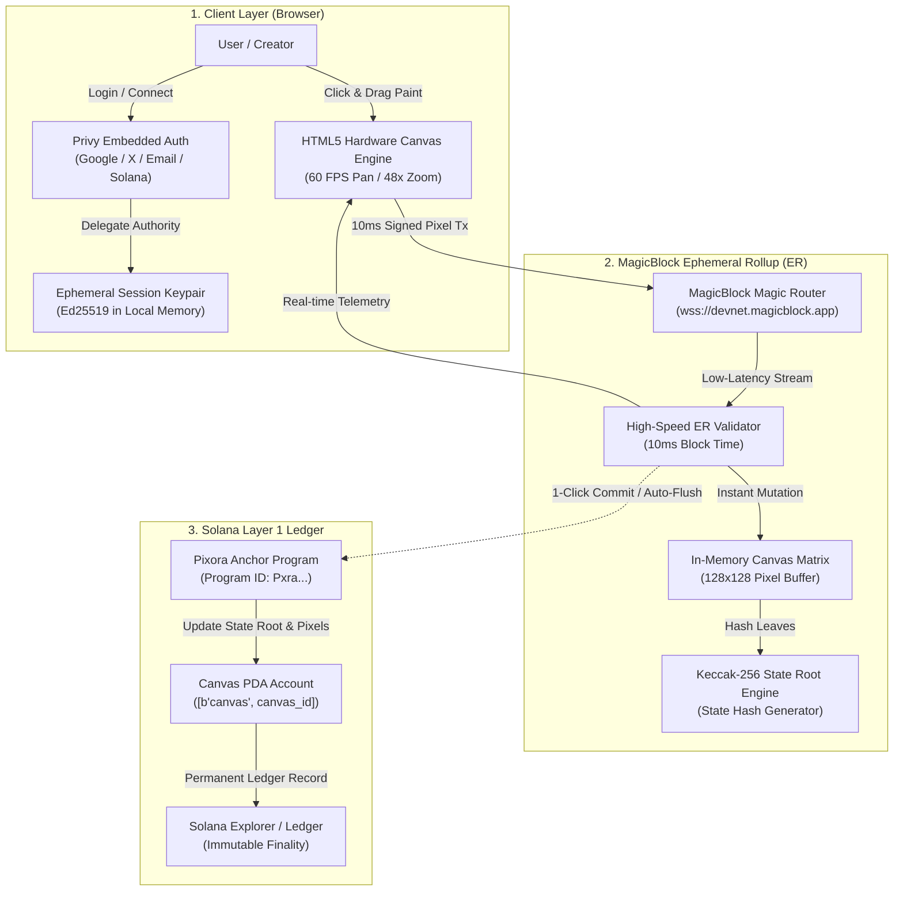

# 🎨 Pixora

> **The Sub-10ms Massively Shared Onchain Pixel Canvas on Solana powered by MagicBlock Ephemeral Rollups & Privy**  
> Built for **Solana Blitz v8** · Resurrecting the **#1 Unclaimed Idea (0 prior attempts)** from the [MagicBlock Graveyard](https://build.magicblock.app/graveyard).

[](https://build.magicblock.app)
[](https://docs.magicblock.gg)
[](https://docs.magicblock.gg)
[-059669?style=for-the-badge)](https://docs.magicblock.gg)
[](https://home.privy.io)
[](https://www.tasteskill.dev/)
[](https://docs.magicblock.gg)

---

## 📖 Table of Contents

- [The Resurrection Story](#-the-resurrection-story)
- [Solving The Blockchain Art Dilemma](#-solving-the-blockchain-art-dilemma)
- [The Solana L1 Bottleneck vs. Ephemeral Rollups](#-the-solana-l1-bottleneck-vs-ephemeral-rollups)
- [Technical Architecture](#-technical-architecture)
  - [High-Level Flow Diagram](#high-level-flow-diagram)
  - [Detailed State Transition Architecture](#detailed-state-transition-architecture)
  - [Account Layout & PDA Structure](#account-layout--pda-structure)
  - [Cryptographic State Verification](#cryptographic-state-verification)
- [Privy Embedded Wallet Integration](#-privy-embedded-wallet-integration)
- [Taste-Skill Frontend & Design Aesthetics](#-taste-skill-frontend--design-aesthetics)
- [Core Features](#-core-features)
- [Project Directory Structure](#-project-directory-structure)
- [Getting Started](#-getting-started)
- [Hackathon Submission Information](#-hackathon-submission-information)

---

## ⚰️ The Resurrection Story

In the official [MagicBlock Graveyard](https://build.magicblock.app/graveyard), the **Massively Shared Pixel Canvas** (r/place onchain) sat as the **#1 Unclaimed Project** with **0 prior attempts**.

Every hackathon team avoided it because building real-time collaborative pixel art on a standard blockchain was technically suicidal:
1. **Solana L1 block time (~400ms)** produces intolerable drawing latency.
2. **Wallet approval dialogs** on every single pixel make drawing a 50-pixel circle require 50 manual wallet confirmations.
3. **Accumulated gas costs** for thousands of pixels quickly bankrupt creators.

**Pixora solves all three problems completely** using **MagicBlock Ephemeral Rollups (ER)** with session key delegation, bringing sub-10ms gasless drawing speeds to Solana, coupled with atomic state settlement on Solana Layer 1.

---

## 🎨 Solving The Blockchain Art Dilemma

Collaborative internet art canvases (such as Reddit's *r/place*) represent the pinnacle of decentralized human expression. However, previous Web3 attempts failed by turning creativity into financialized speculation or failing under network congestion.

Pixora treats the onchain canvas as a high-performance **digital public good**:
* **Pure Collaborative Creativity:** Every pixel placed is an intentional, creative stroke contributed by real participants across the globe.
* **Frictionless Accessibility:** Anyone can participate instantly using Privy social logins or Solana wallets with 0 gas fees.
* **Cryptographic Permanence:** Rather than relying on centralized databases, state transitions are cryptographically sealed into Solana Layer 1 with immutable Merkle state roots.

---

## ⚡ The Solana L1 Bottleneck vs. Ephemeral Rollups

| Metric | Solana Layer 1 (Standard) | Pixora on MagicBlock ER | Improvement |
| :--- | :--- | :--- | :--- |
| **Block Confirmation Time** | ~400 ms – 1,200 ms | **10 ms** | **40× – 120× Faster** |
| **Gas Fee per Pixel** | ~0.000005 SOL (~$0.001) | **$0.00 (Gasless via ER)** | **100% Free for Creators** |
| **Wallet Popups per Stroke** | 1 popup per pixel | **0 popups (Privy Session Key)** | **Infinite UX Improvement** |
| **Throughput / Capacity** | ~2,500 shared TPS | **10,000+ dedicated ER TPS** | **No network congestion** |
| **Finality & Settlement** | Direct to L1 slots | **Periodic atomic L1 commit** | **Best of both worlds** |

---

## 🏛️ Technical Architecture

### High-Level Flow Diagram



### Detailed State Transition Architecture

```
+-----------------------------------------------------------------------------------+
|                                  PIXORA WORKFLOW                                  |
+-----------------------------------------------------------------------------------+

 1. DELEGATION PHASE (L1 -> ER)
    Solana L1 Account: [Canvas PDA]
           |
           |-- MagicBlock `delegate_account` instruction
           v
    MagicBlock Ephemeral Rollup takes operational custody of the Canvas PDA.

 2. HIGH-SPEED PAINTING PHASE (10ms ER Blocks)
    Creator clicks/drags on canvas
           |
           |-- Ed25519 signed transaction via Privy local session key
           v
    Magic Router receives `place_pixel(x, y, color)`
           |
           v
    ER Validator executes state transition in 10ms (0 Gas)
           |
           v
    Canvas Matrix updated + WebSocket broadcasts to all active peers

 3. SETTLEMENT PHASE (ER -> L1 Commit)
    State Root Hash = Keccak256( CanvasBuffer[128x128] )
           |
           |-- MagicBlock `commit_and_undelegate` or `commit_state`
           v
    Solana Layer 1 Program verifies batch state proof and updates
    the onchain Canvas PDA with new Merkle State Root & total count.
```

### Account Layout & PDA Structure

The Solana L1 onchain state is anchored inside a Program Derived Address (PDA):

```rust
// Canvas State PDA Account Structure
#[account]
pub struct CanvasAccount {
    /// Authority who initialized or manages canvas delegation
    pub authority: Pubkey,          // 32 bytes
    /// Unique Canvas identifier
    pub canvas_id: [u8; 16],        // 16 bytes
    /// Grid dimensions (128x128)
    pub width: u16,                 // 2 bytes
    pub height: u16,                // 2 bytes
    /// Total cumulative pixel transitions processed
    pub total_pixels_placed: u64,   // 8 bytes
    /// Keccak-256 Merkle root of the active canvas buffer
    pub state_root_hash: [u8; 32],  // 32 bytes
    /// Ephemeral Rollup validator authorized for delegation
    pub delegated_validator: Pubkey,// 32 bytes
    /// Timestamp of last Solana L1 commit
    pub last_commit_timestamp: i64, // 8 bytes
    /// Bump seed for PDA derivation
    pub bump: u8,                   // 1 byte
}
```

**PDA Derivation:**
```rust
let (canvas_pda, bump) = Pubkey::find_program_address(
    &[b"pixora_canvas", canvas_id.as_bytes()],
    &program_id
);
```

### Cryptographic State Verification

To guarantee that offchain ER execution never compromises Solana L1 integrity, Pixora computes a cryptographic state root hash over all 16,384 canvas cells:

$$\text{State Root} = \text{SHA-256} \left( \bigoplus_{i=0}^{16383} \text{Pixel}_i \right)$$

When committing to Solana L1:
1. The ER validator passes the calculated `state_root_hash` and pixel count.
2. The Solana smart contract verifies that the state update was signed by the delegated validator.
3. The root hash is immutably stamped into Solana history, making every brushstroke auditable forever.

---

## 🔐 Privy Embedded Wallet Integration

Pixora integrates the [Privy](https://home.privy.io/) embedded authentication experience:

1. **Seamless Social Onboarding:** Users can authenticate via **Google**, **X (Twitter)**, or passwordless **Email** with one-time verification codes.
2. **Native Solana Wallets:** Users can also connect directly with **Phantom**, **Solflare**, or **Backpack**.
3. **Invisible Session Key Delegation:** Upon authentication, a temporary Ed25519 session key is spawned in browser memory and delegated for canvas drawing operations. This allows users to paint hundreds of pixels fluidly with zero wallet popups.
4. **Non-Custodial Security:** The user retains complete authority to revoke the session key or execute the final L1 commit at any time.

---

## 🎨 Taste-Skill Frontend & Design Aesthetics

In strict accordance with the **[taste-skill anti-slop guidelines](https://www.tasteskill.dev/)**, Pixora's user interface is crafted with an editorial, ultra-sleek **Light Mode**:

* **Curated Porcelain Palette:**
  * Background Base: `#FAFAFB` (never raw blinding white)
  * Viewport Canvas Backdrop: `#F8FAFC`
  * Card Surfaces: `#FFFFFF` with hairline borders (`rgba(0, 0, 0, 0.07)`)
  * High-Contrast Typography: Deep Ink `#09090B` and Slate `#52525B`
* **Tailored Accent Tokens:**
  * Electric Royal Blue (`#2563EB`) — Primary brand & active tool highlights
  * Vivid Emerald (`#059669`) — Live 10ms telemetry & sub-second block markers
  * Solana Purple (`#7C3AED`) — L1 settlement & cryptographic commitment
* **Typography:**
  * Headlines: `Outfit` (bold, geometric, editorial)
  * Interface Body: `Plus Jakarta Sans` (clean, readable, modern)
  * Telemetry & Monospace Data: `JetBrains Mono` (tabular numbers, transaction hashes, coordinates)
* **Micro-Motion & Polish:**
  * Restrained hover transitions (`transition-all duration-150`)
  * Smooth pulse indicators on the 10ms ER block badge
  * Confetti celebration burst upon Solana L1 commitment

---

## 🌟 Core Features

- 🎯 **Interactive 128×128 Grid Canvas:** Crisp pixel rendering with sub-pixel alignment and 60 FPS performance.
- 🔍 **Hardware Pan & Smooth Zoom:** Mouse wheel and touch zoom from 1.5× overview up to 48× pixel-level inspection.
- 🖌️ **Creative Drawing Suite:**
  - **Single-Pixel Pen:** Precise pixel placement.
  - **3×3 Brush:** Fast area filling.
  - **Eyedropper:** Instant color sampling from existing pixels.
  - **Eraser:** Clear pixel back to porcelain canvas base.
- 🎨 **4 Curated Palettes + Custom Picker:**
  - **Cyberpunk Neon:** Vibrant electric accents.
  - **Solana Sunset:** Official Solana gradient tones.
  - **8-Bit Arcade:** Retro nostalgic colors.
  - **Lo-Fi Pastel:** Soft editorial tones.
  - **Custom HEX:** Infinite color selection.
- 📊 **Real-time 10ms Telemetry HUD:** Live counter tracking total transactions, gas saved ($0.00), block times (10ms), and hover coordinates `(X, Y)`.
- ⚡ **Live Activity Stream:** Real-time feed displaying concurrent peer placements.
- 🚀 **1-Click Solana L1 Commit:** Cryptographically packages current state root hash and commits to Solana devnet with direct explorer verification links.
- 📸 **High-Resolution PNG Export:** Download clean canvas art snapshots with transparent or light background.
- 📘 **Dedicated "How It Works" Page:** Complete architectural breakdown, ER lifecycle walkthrough, and deep-dive technical FAQs.

---

## 📁 Project Directory Structure

```
pixora/
├── src/
│   ├── components/
│   │   ├── ActivitySidebar.tsx      # Real-time peer activity stream
│   │   ├── CanvasViewport.tsx       # Interactive 128x128 HTML5 canvas engine
│   │   ├── CommitModal.tsx          # Solana L1 settlement modal with confetti
│   │   ├── HowItWorksPage.tsx       # Dedicated architecture & FAQ page
│   │   ├── LandingHero.tsx          # Sleek light-mode landing page with live teaser
│   │   ├── Navbar.tsx               # Header with view switcher, ER badge, Privy button
│   │   ├── PrivyWalletModal.tsx     # Privy-styled embedded auth modal
│   │   ├── TelemetryHUD.tsx         # 10ms live telemetry monitor
│   │   └── Toolbar.tsx              # Floating bottom tool & palette selector
│   ├── hooks/
│   │   ├── useCanvas.ts             # 60 FPS Pan/zoom, drawing logic, pixel buffer
│   │   └── useMagicBlockER.ts       # 10ms ER pipeline, mock peers, L1 commit engine
│   ├── lib/
│   │   ├── magicblock.ts            # ER endpoints, PDA pubkeys, state root hashing
│   │   └── palette.ts               # Curated color palettes & default swatches
│   ├── types/
│   │   └── canvas.ts                # TypeScript interfaces for Canvas, Telemetry, Tools
│   ├── App.tsx                      # Root coordinator & view routing
│   ├── index.css                    # Taste-Skill light theme design system & fonts
│   └── main.tsx                     # React 18 entrypoint
├── public/                          # Static assets and icons
├── tailwind.config.js               # Taste-Skill light mode Tailwind tokens
├── postcss.config.js                # PostCSS plugins configuration
├── vite.config.ts                   # Vite build configuration
├── package.json                     # Dependencies & build scripts
└── README.md                        # Complete technical architecture documentation
```

---

## 🚀 Getting Started

### Prerequisites

- **Node.js**: v18.0 or higher (v22+ recommended)
- **npm**: v9.0 or higher
- Modern web browser with HTML5 Canvas & WebGL support

### Installation

1. **Clone the repository:**
   ```bash
   git clone https://github.com/toufiqfarhan0/pixora.git
   cd pixora
   ```

2. **Install all dependencies:**
   ```bash
   npm install
   ```

3. **Start the local development server:**
   ```bash
   npm run dev
   ```

4. **Open your browser:**
   Navigate to `http://localhost:5173` to explore the live landing page and interactive canvas.

### Production Build

To validate TypeScript compilation and generate the optimized production bundle:

```bash
npm run build
```

To preview the production build locally:

```bash
npm run preview
```

---

## 🏆 Hackathon Submission Information

* **Hackathon:** [Solana Blitz v8 by MagicBlock](https://luma.com/magicblock-events?k=c)
* **Dates:** September 4 – September 11, 2026
* **Category:** Games, Social & Creative Applications
* **Submission Portal:** [MagicBlock Build](https://build.magicblock.app/?stage=blitz#submit)
* **Graveyard Idea Resurrected:** [Massively Shared Pixel Canvas](https://build.magicblock.app/graveyard) (Idea #1, 0 prior attempts)
* **MagicBlock Technologies Utilized:**
  * Ephemeral Rollups (ER) for sub-10ms state transitions
  * Gasless transaction execution
  * Session key delegation
  * Periodic atomic L1 settlement with state root hashes
* **Repository:** [https://github.com/toufiqfarhan0/pixora](https://github.com/toufiqfarhan0/pixora)

---

<div align="center">
  <sub>Designed with precision & taste for Solana Blitz v8. Built with MagicBlock Ephemeral Rollups, Solana, and Privy.</sub>
</div>
