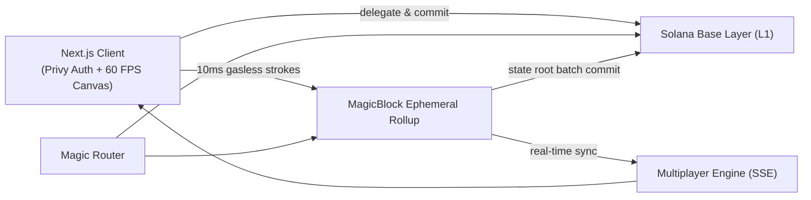

# Pixora

A real-time massively shared pixel canvas on Solana. Everyone paints the same 128×128 board at the same time, with sub-10ms confirmation and zero gas fees.

🚀 **Live Deployment**: [https://pixora-eta-rust.vercel.app/](https://pixora-eta-rust.vercel.app/)  
📹 **Demo Video Folder**: [Google Drive Demo Folder](https://drive.google.com/drive/folders/14_99VIrGWxsT-F50CVOUHnOT44g0xuH9?usp=drive_link)

If you have used Reddit's *r/place* or collaborative drawing tools the concept will feel familiar, except here every pixel is cryptographically signed and settled on Solana. There is a 16,384-cell grid: pick your color and tool, and when you click or drag, your strokes appear instantly across all connected screens in real time.

Built for Solana Blitz v8, which is themed around collaborative games and requires a MagicBlock Ephemeral Rollup integration.

| | |
| **Live App** | [https://pixora-eta-rust.vercel.app/](https://pixora-eta-rust.vercel.app/) |
| **Demo Video** | [Google Drive Folder](https://drive.google.com/drive/folders/14_99VIrGWxsT-F50CVOUHnOT44g0xuH9?usp=drive_link) |
| **Program ID** | `Pxra6Kev7iEom8n9zF2fHQKwhu68hL4WnU2qVwB7uS8` |
| **Canvas Account (PDA)** | `8TnYwxdZvPywRioeUkkWTwaynU7jRTfEvF2GJizBvk9A` (Delegated to ER) |
| **L1 Settlement Tx** | [`2wccdWJj...ut5RdH78`](https://explorer.solana.com/tx/2wccdWJjvWuawQ8smHhtjoTMw6KdZ4RwyUwWHGn8T5FHNpGk4cJ3wFR6p537Uw6NXp67xMsEFdJR5RFrut5RdH78?cluster=devnet) |
| **Network** | Solana Devnet |
| **Rollup Layer** | MagicBlock Ephemeral Rollup (`https://devnet.magicblock.app`) |
| **Authentication** | Privy Web3 Auth (MetaMask, Email & Google on Solana) |

---

## How it works

1. **The Board**: The canvas is a 128×128 grid (16,384 discrete onchain pixel cells).
2. **Spectating**: Anyone can open the canvas and watch strokes land live in real-time with zero login required.
3. **Painting**: Connect your wallet via Privy (MetaMask, Email, or Google login with automatic Solana embedded wallets) to place pixels. Purely Solana with zero Ethereum.
4. **Instant 10ms Confirmations**: Drag-to-paint uses Bresenham's line algorithm to render smooth continuous strokes. Strokes confirm in 10ms on the Ephemeral Rollup with $0.00 gas fees.
5. **Multiplayer Live Cursors**: Connected painters see each other's live cursors and strokes across browsers and devices.
6. **Provenance & Inspection**: Click any pixel in *Inspect* mode to view the author's Solana wallet address, timestamp, and onchain transaction link.
7. **Battle Heatmap**: Toggle the heatmap overlay to see contested zones and high-activity turf battles.
8. **Solana Template Overlay**: Toggle the community template guide to coordinate artwork placement with fellow painters.
9. **Solana L1 Settlement**: At any time, a painter can click **Commit to L1** to compute a Merkle state root hash over all 16,384 cells and commit the artwork permanently to Solana Devnet.
10. **PNG Export**: One-click download of the complete canvas art as a PNG.

---

## Why MagicBlock

A live, massively multiplayer canvas with fluid drag-painting is impossible directly on base layer Solana:
- **Slot Latency (~400ms – 1,200ms)**: Drawing fluid art feels slow, choppy, and lags behind mouse movement.
- **Wallet Signature Fatigue**: Drawing a simple 50-pixel stroke would trigger 50 wallet popup approval prompts.
- **Gas Costs**: Accumulating thousands of transaction fees makes interactive communal art expensive.

So the entire canvas account is delegated to a **MagicBlock Ephemeral Rollup**:
- The canvas state account lives in memory on the rollup validator.
- Strokes land in **10ms with zero gas**, enabling 60 FPS painting.
- The canvas state gets cryptographically committed back down to Solana Layer 1 with a verifiable Merkle root hash.

---

## Architecture



- **Solana Base Layer (L1)**: Holds the Anchor program (`pixora-canvas`), canvas PDA configuration, and final Merkle state root settlements.
- **Ephemeral Rollup**: Holds the delegated canvas account in-memory. All pixel placements, multi-artist overwrites, and session validations happen here at 10ms block times with 0 SOL gas.
- **Real-Time Multiplayer Engine**: Next.js Server-Sent Events (SSE) and BroadcastChannel stream live pixel events and cursor coordinates across all connected browser sessions.

---

## Dedicated Routes

- **`/`**: Landing page with platform overview, live interactive preview, and feature breakdown.
- **`/canvas`**: Dedicated 60 FPS live collaborative canvas.
- **`/how-it-works`**: Detailed architectural guide and Ephemeral Rollup lifecycle.

---

## Getting Started

### 1. Install Dependencies

```bash
pnpm install
```

### 2. Configure Environment Variables

Create a `.env` file in the root directory (or copy from `.env.example`):

```bash
cp .env.example .env
```

```env
# Privy App ID for Web3 Authentication
NEXT_PUBLIC_PRIVY_APP_ID=cmtvfvjwh03p70bl3nzvog9ju

# Solana Cluster & RPC URL
NEXT_PUBLIC_SOLANA_CLUSTER=devnet
NEXT_PUBLIC_SOLANA_RPC_URL=https://api.devnet.solana.com

# MagicBlock Ephemeral Rollup Router & WebSocket RPC
NEXT_PUBLIC_MAGICBLOCK_ROUTER_URL=https://devnet.magicblock.app
NEXT_PUBLIC_EPHEMERAL_RPC_URL=wss://devnet.magicblock.app

# Anchor Program ID & Canvas Account PDA
NEXT_PUBLIC_PROGRAM_ID=Pxra6Kev7iEom8n9zF2fHQKwhu68hL4WnU2qVwB7uS8
NEXT_PUBLIC_CANVAS_PDA=8TnYwxdZvPywRioeUkkWTwaynU7jRTfEvF2GJizBvk9A
```

### 3. Run Development Server

```bash
pnpm dev
```

Open [http://localhost:3000](http://localhost:3000) in your browser.

### 4. Build for Production

```bash
pnpm build
```
