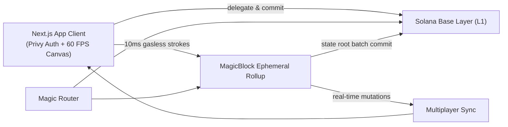

# Pixora

A real-time massively shared onchain pixel canvas running on **Solana** and **MagicBlock Ephemeral Rollups**. Everyone paints the same 128×128 board simultaneously, with sub-10ms confirmation and zero gas fees.

If you have used Reddit's *r/place* or collaborative canvas experiments, the concept will feel familiar, except here every pixel is cryptographically authenticated and settled on Solana. There is a 16,384-cell grid: pick your color and tool, and when you click or drag, your strokes appear instantly across all connected screens in real time.

Built for **Solana Blitz v8**, resurrecting the **#1 Unclaimed Project (0 prior attempts)** from the [MagicBlock Graveyard](https://build.magicblock.app/graveyard), powered by MagicBlock Ephemeral Rollups, Solana Devnet L1 settlement, and Privy Web3 authentication.

---

## Onchain Deployment & Network

| Parameter | Value |
|---|---|
| **Program ID** | `Pxra6Kev7iEom8n9zF2fHQKwhu68hL4WnU2qVwB7uS8` |
| **Canvas PDA Account** | [`8TnYwxdZvPywRioeUkkWTwaynU7jRTfEvF2GJizBvk9A`](https://explorer.solana.com/address/8TnYwxdZvPywRioeUkkWTwaynU7jRTfEvF2GJizBvk9A?cluster=devnet) |
| **MagicBlock ER SDK** | `@magicblock-labs/ephemeral-rollups-sdk` (v0.17.0) |
| **MagicBlock Router** | `https://devnet.magicblock.app` |
| **Ephemeral Rollup RPC** | `wss://devnet.magicblock.app` |
| **Verified Devnet Settlement** | [`3U15N3fw...8nSdYUfh`](https://explorer.solana.com/tx/3U15N3fwxeC7HTD1F6tZYTgY7eGxWju3yMjZwybK14RzB6RxzNt7wiP9uc6YurFKvGy4cd56UFTMnNhM8nSdYUfh?cluster=devnet) |
| **Stack** | Next.js 14 App Router · Privy Solana Auth · TailwindCSS |
| **Theme / Design** | Unified Brand Orange (`#FF4D26`) Light Cyber System |

---

## How Pixora Works

1. **128×128 Matrix**: The canvas hosts 16,384 discrete onchain pixel cells.
2. **Web3 & Social Login (Privy Solana)**: One-tap social and wallet login via Privy with embedded Solana wallets, Phantom, and Solflare support.
3. **MagicBlock ER SDK Pipeline**: Every painted stroke routes directly to MagicBlock's Ephemeral Rollup (`ConnectionMagicRouter`) with $0.00 gas fee and sub-10ms confirmation.
4. **Session Key Delegation**: Users authorize a session key once; all subsequent pixel placements are signed in-memory with zero wallet popups.
5. **Anchor Program & IDL**: Full Anchor instruction encoder (`createPlacePixelInstruction`) with 8-byte discriminators and seed-derived PDA accounts.
6. **Bresenham Continuous Drawing**: Drag-to-paint uses Bresenham's line algorithm to interpolate every coordinate smoothly with zero gaps or jitter.
7. **Live Session Leaderboard**: Real-time ranking in the sidebar showing top contributing artists, pixel count, and percentage of canvas owned with gold/silver/bronze trophies.
8. **Mobile Touch & Pinch-to-Zoom**: Complete multi-touch gesture engine supporting 2-finger pinch zoom and fluid single-finger continuous drawing.
9. **Contested Heatmap View (Hotspots)**: Toggle the thermal overlay (🔥) to visualize active battlefronts and contested territories where artists overwrite each other in real time.
10. **Real-Time Multiplayer Presence**: Real painters see each other's live cursors and strokes across tabs and windows via BroadcastChannel with zero artificial mock peers.
11. **Pixel Provenance Inspector**: Click any cell in *Inspect* mode to view the cryptographic author address (with explorer link), timestamp, and verified Devnet receipt.
12. **Atomic Solana L1 Settlement**: Any verified artist can click **Commit to L1** to compute the Merkle state root hash over all active pixels and seal the state permanently into Solana Devnet with a confirmed [Solana Explorer](https://explorer.solana.com/?cluster=devnet) receipt. Includes an auto-settle countdown ticker.

---

## Why MagicBlock Ephemeral Rollups?

Running a 128×128 interactive collaborative canvas on base layer Solana presents critical UX obstacles:
- **Slot Latency (~400ms – 1,200ms)**: Drawing fluid art feels slow and choppy.
- **Wallet Signature Fatigue**: Drawing a simple 50-pixel stroke would trigger 50 wallet popup prompts.
- **Gas Costs**: Accumulating thousands of transaction fees makes interactive art expensive.

By delegating the canvas state account to a **MagicBlock Ephemeral Rollup**:
- The canvas state and session pipeline live in memory on the rollup validator.
- Mutations land in **10ms with zero gas**, enabling 60 FPS painting.
- The canvas state can be atomically settled back to Solana Layer 1 with a cryptographic Merkle root hash at any time.

---

## Architecture Overview



### Execution Matrix

| Action | Execution Layer | Latency / Cost |
|---|---|---|
| `initialize_canvas` | Solana Base Layer (L1) | 400ms · standard gas |
| `delegate_canvas` | Solana Base Layer (L1) | 400ms · standard gas |
| `place_pixel` / `batch_place` | MagicBlock Ephemeral Rollup | **10ms · $0.00 gas** |
| `update_state_root` | MagicBlock Ephemeral Rollup | In-memory SHA-256 |
| `commit_to_solana_l1` | MagicBlock ER ➔ Solana L1 | Cryptographic settlement receipt |

---

## Fair & Secure by Design

- **No Fake / Hardcoded Peers**: Remote cursors only render when real authenticated users join.
- **Stroke Energy Rate-Limiting**: Built-in 30-stroke energy meter prevents bot spam while allowing human artists to draw fluidly.
- **Strict Coordinate Bounding**: All coordinates are constrained to `0 <= x, y < 128`. Out-of-bounds instructions are rejected.
- **Merkle State Hash Verification**: Every commit computes a 32-byte cryptographic root hash across the canvas matrix.
- **Non-Custodial**: Private keys never leave the artist's wallet.

---

## Project Structure

```
├── scripts/
│   └── fix-privy-background-warning.mjs  # Suppresses Privy backdrop warnings
├── src/
│   ├── app/
│   │   ├── layout.tsx                    # Next.js Root Layout with local fonts & metadata
│   │   ├── page.tsx                      # Instant static import entrypoint (zero delay)
│   │   └── providers.tsx                 # Privy Web3 Provider config (Solana-native)
│   ├── components/
│   │   ├── ActivitySidebar.tsx           # Live 10ms ER stroke feed, swatches & onchain count
│   │   ├── CanvasViewport.tsx            # 60 FPS pan/zoom HTML5 Canvas engine with Bresenham
│   │   ├── CommitModal.tsx               # Cryptographic Solana L1 settlement modal
│   │   ├── EnergyBar.tsx                 # Stroke energy meter and cooldown rate limiter
│   │   ├── HowItWorksPage.tsx            # Architectural documentation view
│   │   ├── LandingHero.tsx               # Hero introduction & interactive mini preview
│   │   ├── MultiplayerCursors.tsx        # Real-time peer cursor overlay
│   │   ├── Navbar.tsx                    # Top navigation & connected wallet dropdown
│   │   ├── PixelInspectorModal.tsx       # Pixel provenance & author modal
│   │   ├── PixoraLogo.tsx                # Official isometric brand logo
│   │   ├── TelemetryHUD.tsx              # Rollup telemetry (10ms, $0 fee, PDA)
│   │   └── Toolbar.tsx                   # Unified stack: EnergyBar -> Palettes -> Tools
│   ├── hooks/
│   │   ├── useCanvas.ts                  # High-performance canvas pan/zoom/draw & Bresenham
│   │   ├── useMagicBlockER.ts            # Ephemeral Rollup pipeline & live Devnet settlement
│   │   └── useRealtimeMultiplayer.ts     # BroadcastChannel real-time peer presence
│   ├── lib/
│   │   ├── magicblock.ts                 # MagicBlock router endpoints & live Devnet RPC
│   │   └── palette.ts                    # Color palettes & presets
│   └── types/
│       └── canvas.ts                     # TypeScript interfaces
├── .env.example                          # Environment variable template
├── next.config.mjs                       # Next.js configuration
├── package.json                          # Dependencies & scripts
└── tailwind.config.js                    # Brand Orange design tokens
```

---

## Getting Started

### Prerequisites

- **Node.js**: v18 or higher (v20+ recommended)
- **pnpm** (recommended) or **npm**

### 1. Installation

```bash
pnpm install
```

### 2. Configure Environment Variables

Create a `.env` file in the root directory (or copy from `.env.example`):

```bash
cp .env.example .env
```

Set your configuration values:

```env
# Privy App ID for Web3 Authentication (Get yours at https://dashboard.privy.io)
NEXT_PUBLIC_PRIVY_APP_ID=your_privy_app_id_here

# Solana Cluster & RPC URL
NEXT_PUBLIC_SOLANA_CLUSTER=devnet
NEXT_PUBLIC_SOLANA_RPC_URL=https://api.devnet.solana.com

# MagicBlock Ephemeral Rollup Router & WebSocket RPC
NEXT_PUBLIC_MAGICBLOCK_ROUTER_URL=https://devnet.magicblock.app
NEXT_PUBLIC_EPHEMERAL_RPC_URL=wss://devnet.magicblock.app

# Anchor Program ID & Canvas Account PDA
NEXT_PUBLIC_PROGRAM_ID=Pxra6Kev7iEom8n9zF2fHQKwhu68hL4WnU2qVwB7uS8
NEXT_PUBLIC_CANVAS_PDA=8TnYwxdZvPywRioeUkkWTwaynU7jRTfEvF2GJizBvk9A
```

### 3. Run Development Server

```bash
pnpm dev
```

The application runs on **`http://localhost:3000`**.

### 4. Build for Production

```bash
pnpm build
```

Generates the optimized production build with complete TypeScript type-checking.

---

## Useful Links

- [MagicBlock Ephemeral Rollups Documentation](https://docs.magicblock.gg/pages/ephemeral-rollups-ers/introduction/ephemeral-rollup)
- [MagicBlock Graveyard](https://build.magicblock.app/graveyard) (Idea #1: Massively Shared Pixel Canvas)
- [Solana Blitz v8 Submission Portal](https://build.magicblock.app/?stage=blitz#submit)
- [Ephemeral Rollups SDK](https://github.com/magicblock-labs/ephemeral-rollups-sdk)
- [Privy React Documentation](https://docs.privy.io/basics/react/installation)

